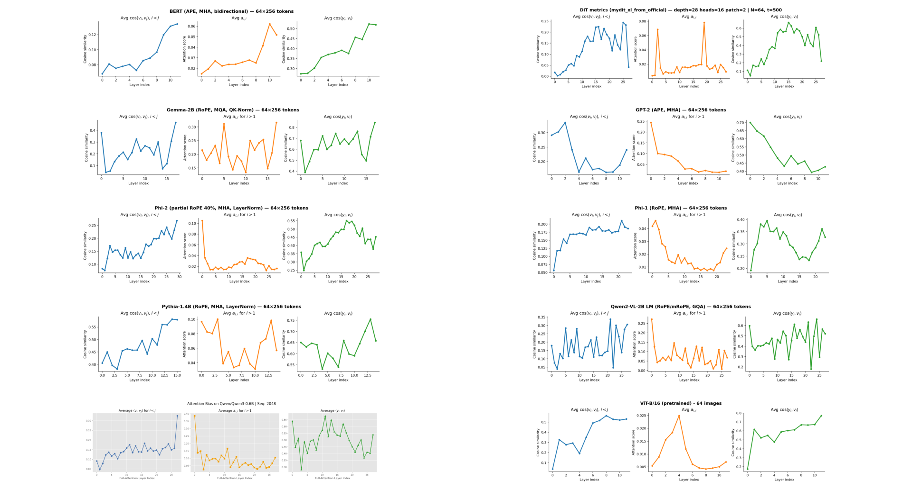

# xsa-marimo 
Exclusive-Self Attention (https://arxiv.org/html/2603.09078) proposes a change in the vanilla self-attention mechanism in transformers.

This molab notebook is an intuitive representation of the XSA geometry and explores the existence of attention-similarity bias across various architectures and modalities.

  

